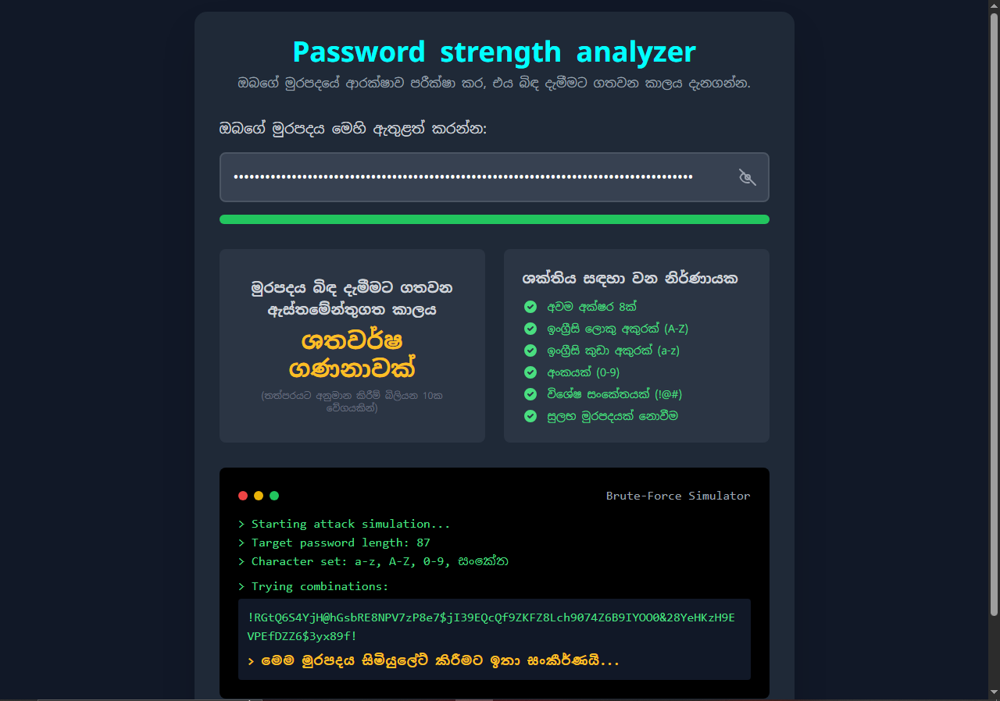

# 🔐 Password Strength Analyzer

This is a **Password Strength Analyzer** web application created by **Maleesha Dewshan**.  
It allows users to test the **strength and security level of their passwords** and provides an estimated **crack time** using brute-force methods.  

---

## 🚀 Features
- Password strength indicator with color-coded progress bar  
- Crack time estimation (based on 10 billion guesses per second)  
- Password validation checklist:
  - Minimum 8 characters  
  - Contains uppercase letters (A-Z)  
  - Contains lowercase letters (a-z)  
  - Contains numbers (0-9)  
  - Contains special characters (!@# etc.)  
  - Not a common password  
- Brute-force attack **simulator** with animated guessing  
- Sinhala + English support  
- Clean, modern UI with **TailwindCSS**  

---

## Live Demo
- <a href="https://maleedew.github.io/Password_strength_analyzer/"> demo </a>

## 📸 Preview 
  

---

## 🛠️ Technologies Used
- **HTML5**  
- **Tailwind CSS** (for styling)  
- **JavaScript (ES6)** (for logic & simulation)  
- **Google Fonts** – Noto Sans Sinhala  

---

## 📂 Installation
Clone the repository and open the HTML file in any browser:

```bash
git clone https://github.com/Maleedew/Password_strength_analyzer.git
cd password_strength_analyzer
